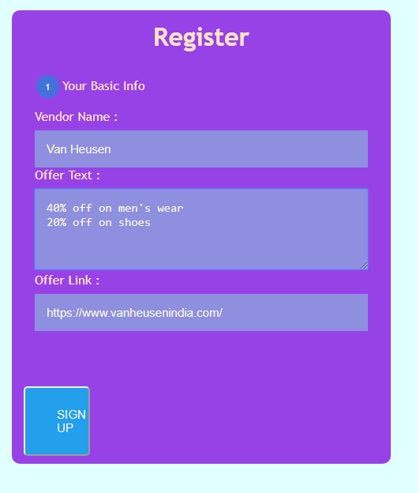
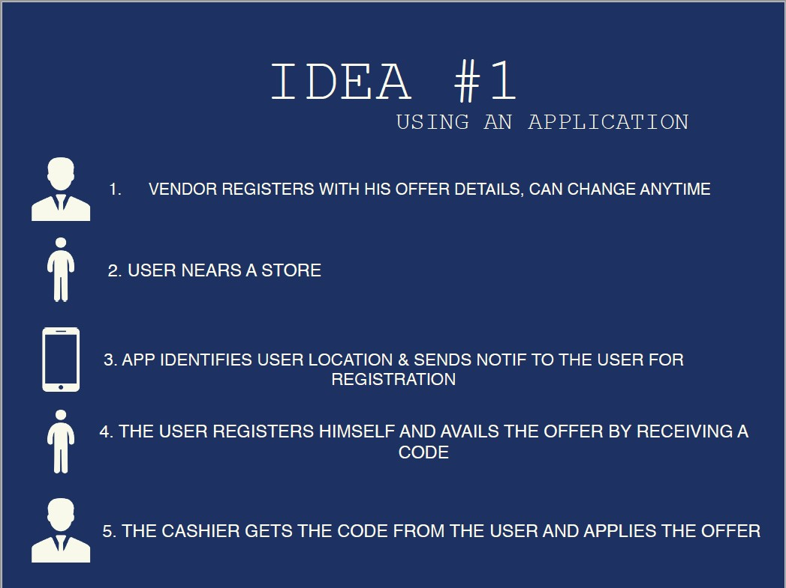
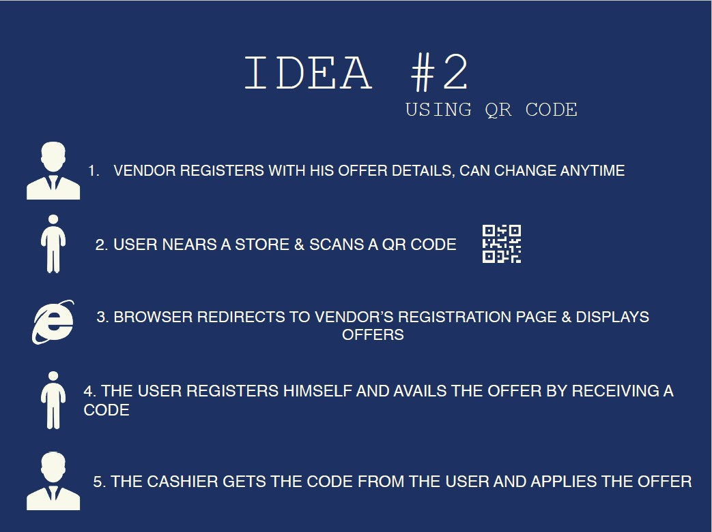
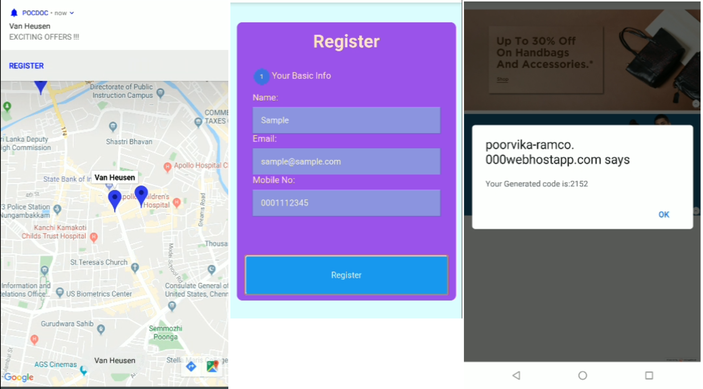

# Shop-Easy

## Crux of the application

### VENDOR SIDE (1/2)
* The vendor registers himself with our application
* [vendor registration](https://poorvika-vendor-signup.000webhostapp.com/index1.html)

## IDEA 1
 

  ### CUSTOMER SIDE
* Shop Easy detects the user's location and sends a notification according to the retail shop he is at.
* The notification redirects to a registration page specific to the shop he/ she is visiting, upon clicking the notification.

## IDEA 2
 

  ### CUSTOMER SIDE
* The customer scans the QR code that redirects to the registration page 
 

## REGISTRATION PROCESS
* The user goes through a quick registration process and he/ she is exposed to a bunch of offers give by the shop he/ she is at.
* A unique code is also generated which when used at checkout, can reduce the interaction between the cashier adn the customer.

### VENDOR SIDE (2/2)
* At the time of check ou the vendor accepts the code from the user to acquire his details
* [vendor billing](https://vendor-billing.000webhostapp.com/)

## DEMO
 

